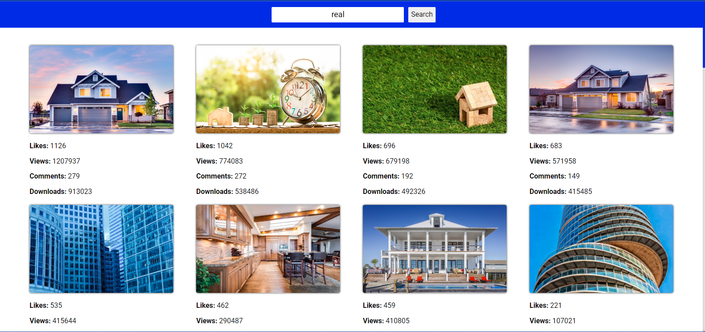

# JS

## Stack of technologies:

## Project description

Pixabay - це платформа, де ви можете знайти та завантажити високоякісні
безкоштовні зображення, відео та ілюстрації. Ця платформа є джерелом для творчих
людей, які шукають візуальний контент для своїх проектів. Ось як ви можете
шукати картинки на Pixabay:

Введіть Запит: У рядку пошуку на головній сторінці введіть запит, що описує те,
що ви шукаєте. Наприклад, "landscape", "food", "business", тощо.

Результати Пошуку: Після того як ви ввели свій запит, вам буде показана сторінка
з результатами пошуку. Ви побачите велику кількість зображень, які відповідають
вашому запиту.

Вибір Зображення: Ви можете переглянути зображення, натискаючи на них. Після
кліку на зображення ви побачите його в більшому розмірі.

https://dmytro1117.github.io/java-script-course/
